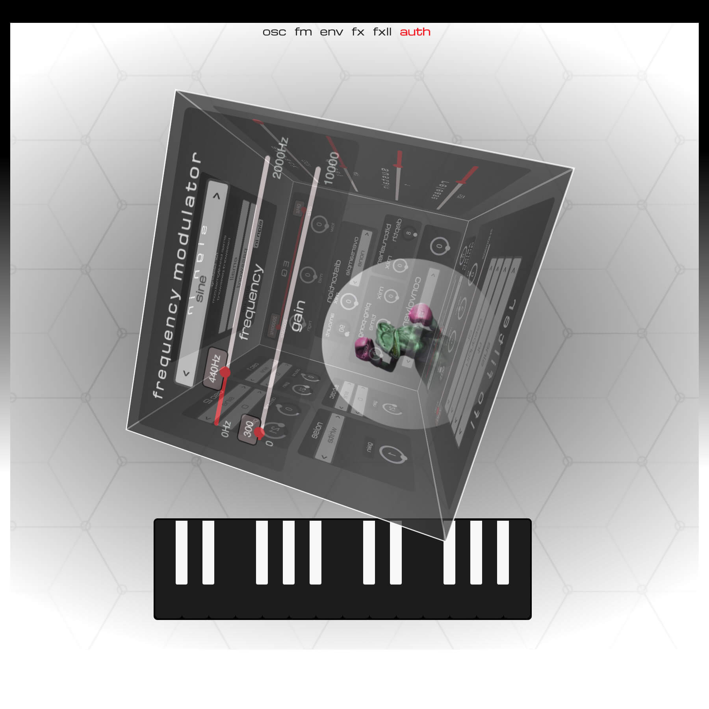

<h1>fm synth</h1>

<h5>An FM synthesizer for the browser <a href="https://fmsynth.vercel.app/">live demo here</a></h5>

An frequency modulation synthesizer built with React, React-Spring, NextJs, ToneJs, and MongoDB. Users can play using the keys of their keyboard, change settings using their mouse, and save presets. Synthesizer state is stored in React Context to make editing, saving, and loading presets easy. NextAuth allows users to create accounts and sign in to retrieve their presets.
